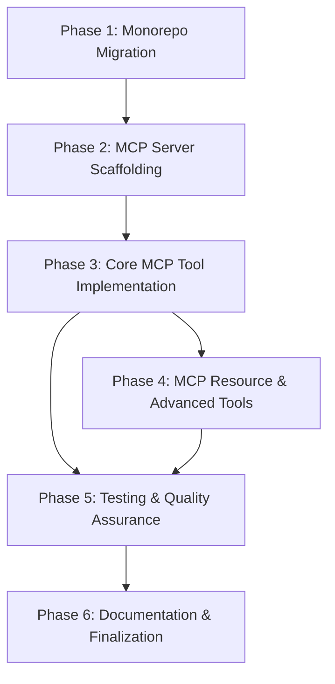

# Implementation Plan: MCP Implementation for Supra L1 SDK

## 1. Plan Overview
This plan outlines the migration of the `supra-l1-sdk` to a monorepo structure and the implementation of a Model Context Protocol (MCP) server.

- **Total Phases**: 6
- **Agents Involved**: `refactor`, `coder`, `tester`, `technical_writer`
- **Estimated Cost**: ~$1.08

## 2. Dependency Graph

## 3. Execution Strategy Table

| Stage | Phases | Agent(s) | Mode |
|-------|--------|----------|------|
| 1 | Phase 1 | `refactor` | Sequential |
| 2 | Phase 2 | `coder` | Sequential |
| 3 | Phase 3 | `coder` | Sequential |
| 4 | Phase 4, 5 | `coder`, `tester` | Parallel (distinct packages/files) |
| 5 | Phase 6 | `technical_writer` | Sequential |

## 4. Phase Details

### Phase 1: Monorepo Migration
- **Objective**: Reorganize the repository into a monorepo using `npm workspaces`.
- **Agent**: `refactor`
- **Files to Modify**:
  - `package.json` (Root): Add workspaces configuration.
  - `tsconfig.json`: Support monorepo paths.
- **Files to Move**:
  - `src/` -> `packages/sdk/src/`
- **Validation**: `npm install && npm run build -w @supra-l1/sdk`

### Phase 2: MCP Server Scaffolding
- **Objective**: Initialize the `packages/mcp-server` package.
- **Agent**: `coder`
- **Files to Create**:
  - `packages/mcp-server/package.json`
  - `packages/mcp-server/tsconfig.json`
  - `packages/mcp-server/src/index.ts`
- **Validation**: `npm run build -w @supra-l1/mcp-server`

### Phase 3: Core MCP Tool Implementation
- **Objective**: Implement the `SupraMcpServer` class and core blockchain tools.
- **Agent**: `coder`
- **Files to Create**:
  - `packages/mcp-server/src/server.ts`
  - `packages/mcp-server/src/tools/coin.ts`
  - `packages/mcp-server/src/tools/package.ts`
  - `packages/mcp-server/src/tools/index.ts`
- **Validation**: Verify server startup and tool registration logic.

### Phase 4: MCP Resource & Advanced Tools
- **Objective**: Implement blockchain resources and transaction management tools.
- **Agent**: `coder`
- **Files to Create**:
  - `packages/mcp-server/src/resources/account.ts`
  - `packages/mcp-server/src/resources/transaction.ts`
  - `packages/mcp-server/src/tools/transaction.ts`
- **Validation**: Verify resource URIs and advanced tool definitions.

### Phase 5: Testing & Quality Assurance
- **Objective**: Configure Vitest and achieve >80% coverage.
- **Agent**: `tester`
- **Files to Create**:
  - `packages/mcp-server/test/server.test.ts`
  - `packages/sdk/test/core.test.ts`
- **Validation**: `npm run test:coverage` showing >80%.

### Phase 6: Documentation & Finalization
- **Objective**: Complete documentation and final validation.
- **Agent**: `technical_writer`
- **Files to Create**:
  - `packages/mcp-server/README.md`
- **Files to Modify**:
  - `README.md` (Root)
- **Validation**: Review all documentation and project integrity.

## 5. Risk Classification

| Phase | Risk | Rationale |
|-------|------|-----------|
| 1 | MEDIUM | Structural changes can break build pipelines and existing imports. |
| 3 | LOW | Standard MCP tool implementation following SDK logic. |
| 5 | MEDIUM | Achieving >80% coverage from scratch requires significant test effort. |

## 6. Execution Profile:
- **Total phases**: 6
- **Parallelizable phases**: 2 (Phase 4 and 5)
- **Sequential-only phases**: 4
- **Parallel Wall Time**: ~4 hours
- **Sequential Wall Time**: ~6 hours
